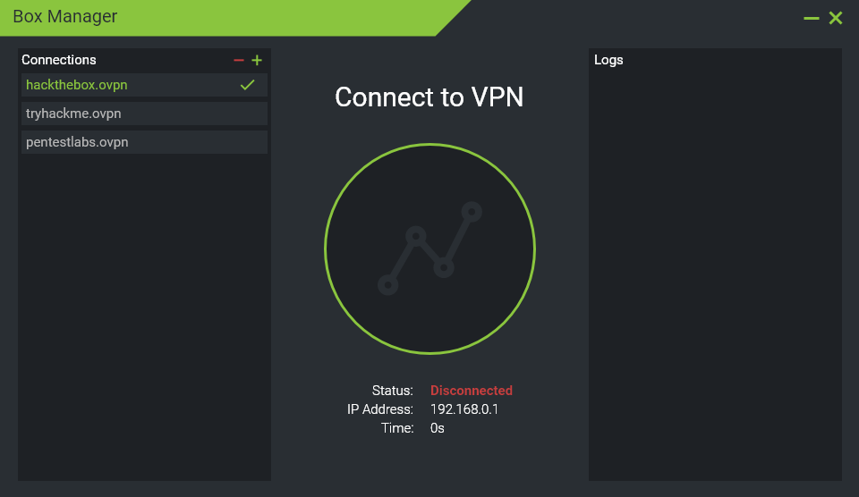
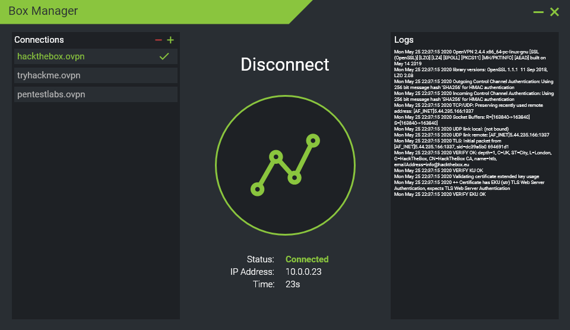

# Box Manager
Java GUI for managing OpenVPN connections. Especially useful for managing connections for pentesting labs like HackTheBox, TryHackMe, etc.

# Wireframes
Below are some wireframes I threw together for the initial design, these may change over time as I develop the program more.

## Initial State

## Connected State

# Color Palette
#8AC53E - Green
#1E2125 - Dark Grey
#292E33 - Light Grey

# Resources
* [Graph Icon](https://www.flaticon.com/free-icon/graph_876225) by Becris Lineal